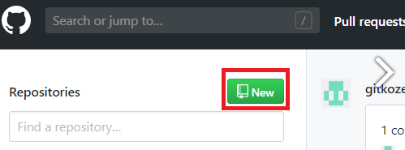
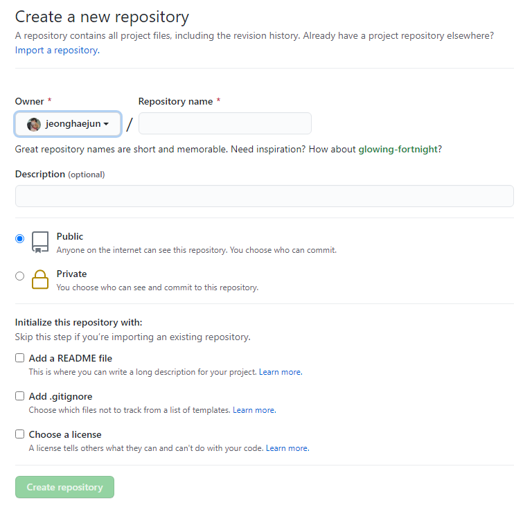
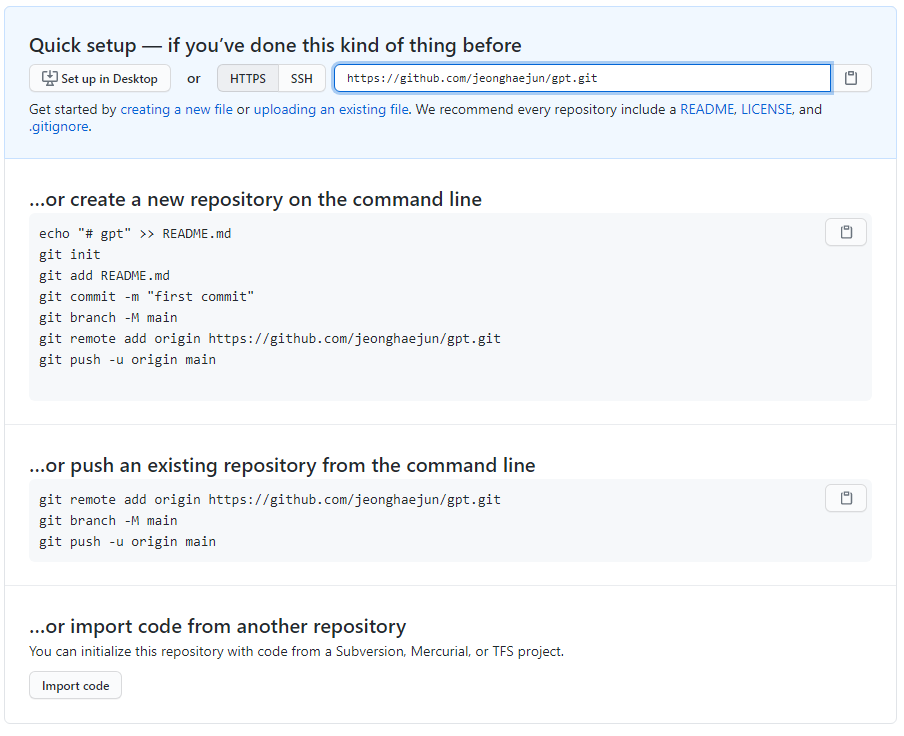

# 원격 저장소와 연결 및 업로드

Git을 제대로 사용하기 위해서는 원격 저장소가 필요하다.

 

Remote repository(원격 저장소)를 사용하면

1. 프로젝트 작업물을 안전 하게 백업할 수 있으며,

2. 많은 사람들과 협업이 용이하다는 장점이 있다.

## github 연결 방법

### Remote Repository 생성

- github 접속 및 로그인

  

- New(New Repository) 클릭

<left>

- Create a New repository 작성

<left>

* 
  * Repository name : 앞으로 사용할 저장소 이름 (즉: 프로젝트 명)
  * 권한 설정
    * Public: 모든 사용자 접근 가능
    * Private: 본인과 지정한 사용자만 접근 가능
  * Create Repository 클릭

  - README.md 파일이란?

    - 저장소의 메인페이지에 저장소에 대한 설명

### Remote Repository 연결

* Remote 와 Local Repository 연결

<left>

* 상단의 https://github.com/jeonghaejun/gpt.git을 복사
  
    
  
* gitbash에 아래 코드를 입력 후 <URL>에 복사한 주소를 입력 

  * ` $ git remote add origin <URL> `or` $ git remote add <name> <URL>`

  ​         - ex)` $ git remote add origin https://github.com/jeonghaejun/gpt.git`

### 원격저장소에 업로드 git push

* 로컬 저장소에 commit한 파일들을 원격 저장소에 추가하는 작업.

  

* gitbash에 아래 코드를 입력 (name이 없을땐 origin으로 push)

  `$ git push origin master` or `$ git push <name> <branch> `

#  git branch

* Software개발시 개발자들은 동일한 소스코드 위에서 신규 개발, 버그 수정 등의 업무를 협업하곤 한다. 이럴 때, 여러 개발자들이 동시에 다양한 작업을 할 수 있게 만들어 주는 기능이 "Branch" 이다.

   즉, 브랜치(Branch)를 통해 하나의 프로젝트를 여러 갈래로 나누어서 관리할 수 있다. 각각의 독립된 Branch에서 마음대로 소스코드를 변경하여 작업 한 후 원래 버전과 비교하여 또 하나의 새로운 버전을 만들어 낼 수 있다.

  

* gitflow workflow : gitflow workflow에서는 항상 유지되는 메인 브랜치들(master, develop)과 일정 기간 동안만 유지되는 보조 브랜치들(feature, release, hotfix)을 포함하여 총 5가지의 브랜치를 사용한다.

  아래는 gitflow workflow 방법에서 사용하는 브랜치의 흐름이다.

<left>
| 명령어                                                       | 설명                                                         |
| ------------------------------------------------------------ | ------------------------------------------------------------ |
| `$git branch`                                                | 현재 내가 위치한 Branch 확인                                 |
| `$ git branch <branch name>`                                 | Branch 생성                                                  |
| `$ git branch -d <branch name>`                              | Branch 삭제                                                  |
| `$ git branch -D <branch name>`                              | Branch 강제 삭제                                             |
| `$ git switch <branch>` == `$ git chekout <branch>`          | 원하는 Branch로 이동                                         |
| `$ git switch  -c <branch>` == `$ git checkout -b <branch>`  | Branch생성과 동시에 이동                                     |
| `$ git checkout <branch/commit_id>`                          | Branch로 이동 / 원하는 commit 시점으로 이동                  |
| `$ git merge <branch>`                                       | master와 Branch를 merge한다.                                 |
| `$ git log --pretty=format:"%h %s" --graph`                  | commit시점과 workflow 그래프를 볼 수 있다.                   |
| `$ git push <name> <branch>` or `$ git push origin <branch>` | 원격저장소에 수정된 commit을 업로드, 원하는 Branch만 업로드 가능 |
| `$ git pull <name> <branch>` or `$ git pull origin <branch>` | 원격저장소에 저장된 commit을 다운로드, 원하는 Branch만 다운로드 가능 |
| `$ git clone <URL>`                                          | 타 로컬저장소에서 원격저장소에 있는 자료를 똑같이 복사해서 가져올 때 사용 |

