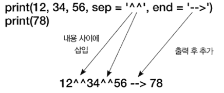

# Python 기초


* 들여쓰기 중요 동일 레벨일 경우 들여쓰기가 같아야 한다.

* 대소문자 구분 (약속: 대문자 변수는 상수저장, 소문자 변수는 변하는 값 저장)

* #이후는 주석문이므로 실행되지 않는다.

  

## 출력


* `print(출력내용 [, sep = 구분자][, end = 끝 문자])`

  * EX)

    ```python
    print(3+4)         # 7
    value = 1234       
    print(value)       # 1234
    print(value * 2)   # 2468
    
    a = 12
    b = 34
    print(a, b)                 # 12 34
    print(a, b, sep = ',')      # 12,34
    print(a, b, sep = '')       # 1234
    print(a, b, sep = ' ---> ') # 12--->34
    
    a = '고양이'
    b = '강아지'
    print(a, end=' ')
    print(b)           # 고양이 강아지
    
    print(12, 34, 56, sep = '^^', end = ' ---> ')
    print(78)          # 12^^34^^56 ---> 78
    ```



## 입력


* `변수 = input('질문내용')`

  * `input`함수는 문자열 타입으로 리턴한다.

  * EX)

    ```python
    age = input('몇 살이세요? ')
    print(age)
    
    몇 살이세요? 29 <---입력값
    29
    
    price = input('가격을 입력하세요 : ')
    num = input('수량을 입력하세요 : ')
    # 아래의 과정은 input함수는 문자열로 리턴하기 때문에 정수로 만들어주는 과정이 필요
    sum = int(price) * int(num)
    print('총액은', sum, '원 입니다.')
    
    가격을 입력하세요 : 500
    수량을 입력하세요 : 10
    총액은 5000 원 입니다.
    ```


## 변수


* 값을 저장하고 있는 메모리에 대한 명칭

* 알파벳, 밑줄, 숫자로 구성

* 첫 글짜로 숫자는 사용 불가하다.

* 대소문자를 구분

* 키워드 사용 불가 (즉, 함수이름을 변수이름으로 지정하지 말기)

* 값의 타입이 고정되어 있지 않음

* 어떠한 값이든 대입 가능

  * EX)

    ```python
    score = 98
    print(score) # 98
    print(score) # <class 'int'>
    
    score = 'high'
    print(score) # high
    print(score) # <class 'str'>
    
    a = 1234
    print(a)
    del a
    print(a)
    
    1234
    # 선언되지 않은 변수 또는 삭제된 변수를 읽으면 오류 발생
    --------------------------------------------------------------------------
    NameError Traceback (most recent call last)
    <ipython-input-7-c3ad5c683aee> in <module>
    3 del a
    4
    ----> 5 print(a)
    NameError: name 'a' is not defined
    
    ```

    