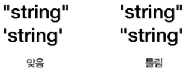

# 타입

----


## 1. 수치형 타입

---

* 정수형

  * 크기에 제한이 없음

  * 값에 따라 크기 자동 조정

    ```python
    a = 1234567890
    print(a)
    
    1234567890
    
    print(a ** 100)
    
    141741726010355877021425242397614266850230984328921683301904823759475770823898
    618248937223189974698092198272832940279328576746286288246412163586040073071625
    403994235108484654701851813111412522017073436551977468182566355508096008844818
    770030666259103383549754706584982939339385133685051351671665495459484240707105
    912956546726469283110832013048361267258779772354758935887424049533897842706489
    170079845902824088981773992924362039029250020367962086497153391426082783460157
    920931418912062690190445848693672762290558236738881832546715962674705459956895
    378670356212279994168084514114818989630510464134483945722383050790176271852886
    739698177596517655470069835676583069071363091251912629058336230389234503573930
    897227480759410337695934859367858714793296706039210143078982981706101059862119
    667407317346718937443597566001000000000000000000000000000000000000000000000000
    0000000000000000000000000000000000000000000000000000
    ```

  * 진법에 따라 표기 및 해석

    | 진법                   | 접두 | 사용 가능한 숫자 | 예     |
    | ---------------------- | ---- | ---------------- | ------ |
    | 16진법 ( hexadecimal ) | 0x   | 0~9, a~f         | 0x2f   |
    | 8진법 ( octal )        | 0o   | 0~7              | 0o17   |
    | 2진법 ( binary )       | 0b   | 0,1              | 0b1101 |

    ```python
    a = 0x1a
    print(a)       # 26
    
    a = 0b1101
    print(a)       # 13
    
    print(26)      # 26
    print(hex(26)) # 0x1a
    print(oct(26)) # 0o32
    print(bin(26)) # 0b11010
    ```

    

* 실수형

  * ```python
    a = 9.46e12
    print(a)     # 9460000000000.0
    ```

    

* 복소수형

  * `실수부 + 허수부j`

    ```python
    a = 1 + 2j
    b = 3 + 4j
    print(a + b) # (4+6j)
    ```


## 2. 문자열

------

* 큰 따움표("), 작은 따움표(')로 묶음

  * 한 줄로 표현

* 삼중 따움표(""")

  * 여러 줄로 표현 가능

* 여는 따움표와 닫는 따움표 동일해야 한다.

  

  

* 따움표 안에 동일한 따움표 사용 못한다.

  ```python
  a = "Korea 서울 1234"
  print(a)                     # Korea 서울 1234
  
  a = "I Say "Hello" to you"
  print(a)
  # 아래는 따움표 안에 동일한 따움표 오류
  ----------------------------------------------
  File "<ipython-input-2-61d48a0f2945>", line 1
  	a = "I Say "Hello" to you"
  					^
  	SyntaxError: invalid syntax
  ----------------------------------------------
  
  a = 'I Say "Hello" to you'
  print(a)                     # I Say "Hello" to you
  a = "I Say 'Hello' to you"
  print(a)                     # I Say 'Hello' to you
  ```

* 문자열 확장 ( 문자 이스케이프 )

  * 개행 문자와 같은 특수 문자를 표기하는 방법

    | 확장열 | 설명        |
    | ------ | ----------- |
    | \n     | 개행        |
    | \t     | 탭          |
    | \\"    | 큰 따옴표   |
    | \\'    | 작은 따옴표 |
    | \\\    | \ 문자      |

  ```python
  a = "I Say \"Hello\" to you"
  print(a)                     # I Say "Hello" to you
  a = 'I Say \'Hello\' to you'
  print(a)                     # I Say 'Hello' to you
  
  a = 'first\nsecond'
  print(a)
  
  first
  second
  
  a = 'first\tsecond'
  print(a)
  
  first second
  ```

* 긴 문자열

  * """를 이용한 방법

    ```python
    s = "여러 줄에 걸쳐
    정의하는 경우"
    # 큰 따옴표 세개로 안하면 오류
    -----------------------------------------------
    File "<ipython-input-9-56d99441bf0b>", line 1
    s = "여러 줄에 걸쳐
    ^
    SyntaxError: EOL while scanning string literal
    -----------------------------------------------
    
    s = """여러 줄에 걸쳐
    정의하는 경우"""
    print(s)
    -----------------------------------------------
    여러 줄에 걸쳐
    정의하는 경우
    -----------------------------------------------
    ```

  * \를 이용한 방법

    ```python
    linecontinue = 365 * 24 *
    60 * 60
    -----------------------------------------------
    line 1
    linecontinue = 365 * 24 *
    ^
    SyntaxError: invalid syntax
    -----------------------------------------------
    
    
    linecontinue = 365 * 24 * \
    60 * 60
    -----------------------------------------------
    31536000
    -----------------------------------------------
    ```
    
  * "" 와 ()를 이용한 방법
  
    ```python
    s = "korea" "japan" "2002"
    print(s)                   # koreajapan2002
    
    s = ("korea"
    "japan"
    "2002")
    print(s)                   # koreajapan2002
    ```
  
* 문자 코드

  ```python
  print(ord('a'))
  print(chr(98))
  for c in range(ord('A'), ord('Z')+1):
  print(chr(c), end='')
  
  97
  b
  ABCDEFGHIJKLMNOPQRSTUVWXYZ
  
  print(ord('a'))
  print(chr(98))
  for c in range(ord('A'), ord('Z')+1):
  print(chr(c), c)
  
  97
  b
  A 65
  :
  Z 90
  ```

* 그 외의 타입

  * 진위형 ( 부울린 )

    * True, False 두가지 값만 가짐

  * None

    * 어떠한 값도 없음을 나타냄

    ```python
    a = 5
    b = a == 5
    print(type(b))
    print(b)
    
    <class 'bool'>
    True
    
    a = None
    print(a)
    
    None
    ```

  * 컬렉션 소개

    * `List`

      ```python
      member = ['손오공', '저팔계', '사오정', '삼장법사']
      print(type(member))
      print(member)
      
      <class 'list'>
      ['손오공', '저팔계', '사오정', '삼장법사']
      ```

    * `Tuple`(읽기 전용)

      ```python
      member = ('손오공', '저팔계', '사오정', '삼장법사')
      print(type(member))
      print(member)
      
      <class 'tuple'>
      ('손오공', '저팔계', '사오정', '삼장법사')
      ```

    * 사전(`dict`) 키와 값의 쌍으로 관리

