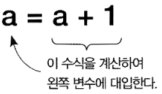

# 연산자

---

## 숫자 연산자

---

* 대입 연산자

  * 어떠한 값을 변수에 저장하는 것

  * 직접 값을 지정

    ```python
    a = 3
    s = 'korea'
    f = 3.1415
    ```

  * 연산의 결과를 값으로 사용

  * 사용하지 않는 변수를 일으면 예외 발생

    ```python
    a = (1 + 2) * 3
    b = c * d + e
    
    # c라는 변수를 지정안해서 오류 발생
    line 2, in <module>
    b = c * d + e
    NameError: name 'c' is not defined
    ```

* 산술 연산자

  *  +, -, *, /

    ```python
    print(3+4)
    print(5-2)
    print(2*4)
    print(8/2)
    
    7
    3
    8
    4.0
    ```

  * ** 거듭제곱

     // 정수 나누기

    % 나머지

    ```python
    print(3**3) # 27
    print(2**10) # 1024
    
    print(5/2) # 2.5
    print(5//2) # 2
    
    print(7%2) # 1
    print(8%3) # 2
    print(9%3) # 0
    ```

* 복합 대입 연산자

  * 변수의 반복 사용을 줄여 주는 축약 표현

  * a += 1

    

    ```python
    a = 5
    a += 1
    print(a) # 6
    a -= 2
    print(a) # 4
    a *= 2
    print(a) # 8
    ```


## 문자열 연산자

----

* 문자열 연결 (*)

  ```python
  print("싫어 " *3)
  print("="*40)
  
  싫어 싫어 싫어
  ========================================
  ```

* 정수와 문자열

  * 문자열만 +로 연결 가능

    * 다른 타입을 연결하려면 `str()`함수로 문자열로 변환 후 결합

  * `str()`: 문자열 변환

  * `int()`: 정수 변환

  * `int(정수, 진법)`

    ```python
    s = "korea" + 2002
    # 뒤의 숫자가 str이 아니라서 오류 발생
    line 1, in <module>
    s = "korea" + 2002
    TypeError: can only concatenate str (not "int") to str
    
    s = "korea" + str(2002)
    print(s)
    korea2002
    
    print(int("1a", 16))
    print(int("15", 8))
    26
    13
    ```

* 실수의 변환

  * `float()`: 실수 변환 함수

  * `round(숫자 [, 반올림 자리수])`: 실수 반올림 함수

    ```python
    print(10 + int(22.5))
    print(10 + int(float("22.5")))
    32
    32
    
    print(int(2.54))
    print(round(2.54))
    print(round(2.54, 1))
    print(round(123456, -3))
    2
    3
    2.5
    123000
    ```

* 기타 타입 변환
  * bool(): 부울 변환 함수
  * list(): 리스트 변환 함수
  * tuple(): 튜플 변환 함수
  * dict(): 사전 변환 함수