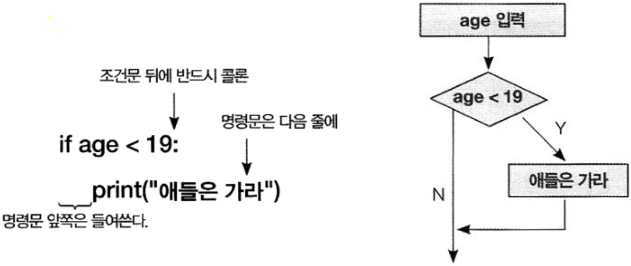
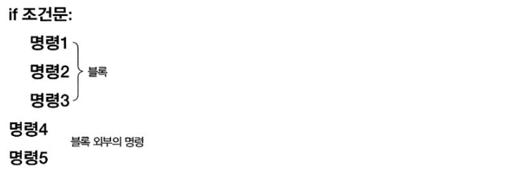
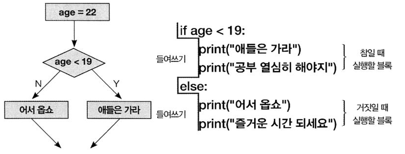
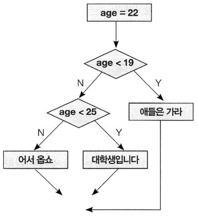

# 조건문

----


## if조건문

* if문

  * 단일 라인 표현식

  * `if 조건 : 명령`

    ```python
    age = int(input("나이를 입력하세요 : "))
    if age < 19:
    print("애들은 가라")
    
    나이를 입력하세요 : 15
    애들은 가라
    ```

    

  <br/>

  <br/>

  <br/>

  <br/>

  <br/>

  <br/>

  <br/>

  <br/>

  <br/>

  <br/>

  <br/>

* 비교 연산자

  * `if`문의 조건에서 주로 사용

    | 연산자 | 설명                        |
    | ------ | --------------------------- |
    | ==     | 같다                        |
    | !=     | 다르다                      |
    | <      | 좌변이 우변보다 작다        |
    | >      | 좌변이 우변보다 크다        |
    | <=     | 좌변이 우변보다 작거나 같다 |
    | >=     | 좌변이 우변보다 크거나 같다 |

    ```python
    country = "Korea"
    
    if "korea" > "japan":
    print("한국이 더 크다")
    if "korea" < "japan":
    print("일본이 더 크다")
    
    # 문자열의 맨앞글자인 k와 j의 숫자코드를 비교하여 이런 결과가 나왔다.
    한국이 더 크다
    ```

* 거짓 값

  * False

  * None

  * 0

  * "" : 비어있는 문자열

  * [],() : 비어있는 컬렉션

    ```python
    print(None, bool(None))
    print(0, bool(0))
    print("", bool(""))
    print([], bool([]))
    print((), bool(()))
    
    None False
    0 False
    False
    [] False
    () False
    ```

* 논리 연산자

  | 연산자 | 설명                       |
  | ------ | -------------------------- |
  | and    | 두 조건이 모두 참이다      |
  | or     | 두 조건 중 하나라도 참이다 |
  | not    | 조건을 반대로 뒤집는다     |

  ```python
  a = 3
  b = 5
  if a == 3 or b == 4:
  print("OK")
  
  OK
  
  a = 3
  if a > 1 and a < 10: # if 1 < a < 10: 이거랑 같은 거다.
  print("OK")
  
  OK
  ```

* 블록 구조

  * `if`문의 명령이 여러 줄인 경우

  * 이들 명령은 모두 동일한 들여쓰기를 해야함

    

    <br/><br/><br/><br/><br/><br/><br/><br/><br/><br/>
    
    ```python
    age = 16
    if age < 19:
    	print("애들은 가라")
    	print("공부 열심히 해야지")
    
    애들은 가라
    공부 열심히 해야지
    
    age = 22
    if age < 19:
    	print("애들은 가라")
    print("공부 열심히 해야지")
    
    공부 열심히 해야지
    ```

* else 문

  * `if`문에서 조건이 `False`인 경우 실행할 명령 지정

    

    <br/><br/><br/><br/><br/><br/><br/><br/><br/><br/><br/>
    
    <br/>
    
    <br/>
    
    <br/>
    
    ```python
    age = 22
    if age < 19:
    	print("애들은 가라")
    	print("공부 열심히 하세요")
    else:
    	print("들어오세요")
    	print("즐거운 시간 되세요")
    	
    들어오세요
    즐거운 시간 되세요
    ```

* elif 문

  * 여러 개의 `if`문으로 조건을 검사할 때 사용

    

    

    ```python
    age= 23
    
    if age < 19:
    	print("애들은 가라")
    elif age < 25:
    	print("대학생입니다")
    else:
    	print("들어오세요")
    
    대학생입니다
    
    # 같은거다
    
    age= 23
    
    if age < 19:
    	print("애들은 가라")
    else:
    	if age < 25:
    		print("대학생입니다")
    else:
    	print("들어오세요")
        
      대학생입니다
    ```
    

* if 문 중복

  ```python
  man = True
  age = 22
  
  if man == True:
  	if age > 19:
  		print("성인 남자입니다.")
  	else:
  		print("미성년 남자입니다.")
  else:
  	if age > 19:
  		print("성인 여자입니다.")
  	else:
  		print("미성년 여자입니다.")
  		
  성인 남자입니다.
  ```

  