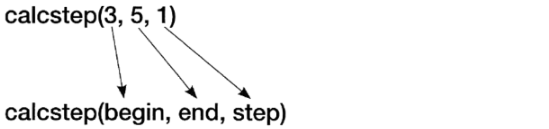
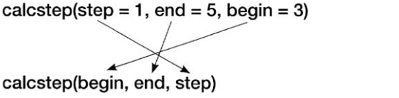

# 함수


## 반복되는 코드

* 함수로 정의하여 반복을 없앤다.

```python
def calcsum(n):
    total = 0
    for num in range(n+1):
        total += num
    return total

print(' ~ 4 =', calcsum(4))
print(' ~ 10 =', calcsum(10))

~ 4 = 10
~ 10 = 55
```


## 인수

* 함수로 값을 전달했을 때 이를 저장하는 변수이다.

```python
def calcrange(begin, end):
    total = 0
    for num in range(begin, end+1):
        total += num
    return total
    
print('3 ~ 7 =', calcrange(3,7)) # 인수 3,7

3 ~ 7 = 25
```


## 리턴값

* 함수의 실행결과를 호출한 곳으로 넘기는 값이다.

```python
def printsum(n):
    total = 0
    for num in range(n+1):
        total += num
    print('~', n, '=', total)

printsum(4)
printsum(10)

~ 4 = 10  # 리턴값
~ 10 = 55 # 리턴값

a = printsum(4)
print(a)

~ 4 = 10  # 리턴값
None      # 리턴값
```


## Pass

* 아무것도 안하고 그냥 넘어감
* 함수는 반드시 코드 블럭이 있어야 하지만 실제 구현을 나중으로 미루고자 할 때 `pass`지정
* 구조를 만들어 놓을 때 쓴다.

```python
def calctotal():
	# 나중에 완성할 것
	pass
if score >= 90:
	pass
else:
	pass
```


## 가변인수

* 인수의 수가 고정되지 않음
* 호출시 원하는 만큼 인수를 지정
* 함수에서는 이를 튜플 변수로 받는다.
* 일반 인수 뒤에만 올수 있다. :dog: 중요!!!!
* 하나만 사용 가능하다.

```python
# 가중치를 전달해서, 가중치의 곱의 합을 리턴하세요.

def intsum(weight, *ints):  # 가변인수를 뒤로 중요하다~~~!!!!!!
    total = 0
    for num in ints:
        if num < 0:
            return  # return None과 동일
        total += num*weight
    return total
    
print(intsum(1.1, 1, 2, 3))                   # 6.6000000000000005
print(intsum(1.5, 5, 7, 9, 11, 13))           # 67.5
print(intsum(0.8,8, 9, 6, 2, 9, 7, 5, 8))     # 43.2

total = intsum(8, 9, 6, 2, -9, 7, 5, 8)
if total:
    print('total=', total)
else:
    print('잘못된 데이터를 포함하고 있습니다.')     # 잘못된 데이터를 포함하고 있습니다.
    
    
values = range(1, 1000)
print(intsum(0.9, *values))  # intsum(0.9,values)이렇게 돌리면 망함
                             # 449549.99999999994(결과)
                             
values = range(1, 5)
print(values)         # range(1, 5)
print(*values)        #1 2 3 4

# 가변인수에 컬렉션을 전달할때는 *을 이용해서 펼쳐서 전달한다.
```


## 인수 기본값

* 함수 호출시 인수가 지정되지 않았을 때 사용할 값 default 값
* 함수 정의시 인수에 값을 대입연사자로 대입
* 인수 목록의 마지막 부분에 배정!!!
* 중간에 배정하면 컴퓨터가 구분하지 못한다.

```python
def calcstep(begin, end=1, step=1):  # 디폴트값은 뒤로 다 몰아야 한다.
    total = 0
    for num in range(begin, end+1, step):
        total += num
    return total


print('1~10 =', calcstep(1, 10, 2))     # 1~10 = 25
print('1~100 =', calcstep(1, 100))      # 1~100 = 5050
print('1 =', calcstep(1))               # 1 = 1
```


## 키워드 인수

* 일반적으로는 함수 호출시 인수의 배치 순서대로 매칭한다.

  

  <br/>

  <br/>

  <br/>

  <br/>

  <br/>

* 인수를 배치 순서가 아닌 인수의 명칭으로 매칭하는 방법

  
  
  <br/>
  
  <br/>
  
  <br/>
  
  <br/>
  
  <br/>

```python
def calcstep(begin, end, step):
    total = 0
    for num in range(begin, end+1, step):
        total += num

    return total


print('3 ~ 5 =', calcstep(3, 5, 1))                    # 3 ~ 5 = 12
print('3 ~ 5 =', calcstep(begin=3, end=5, step=1))     # 3 ~ 5 = 12 
print('3 ~ 5 =', calcstep(step=1, end=5, begin=3))     # 3 ~ 5 = 12
print('3 ~ 5 =', calcstep(3, 5, step=1))               # 3 ~ 5 = 12
print('3 ~ 5 =', calcstep(3, step=1, end=5))           # 3 ~ 5 = 12

print(1, 2, 3, sep=",", end="======")  # 앞에 123은 포지션 인수, 뒤에 end, sep는 키워드 인수
print(1, 2, 3, end="======", sep=",")  # 1,2,3=====
```


## 키워드 가변인수

* 키워드 인수를 가변 개수로 전달할 때 사용하는 방법이다.
* **기호로 지정하며 타입은 사전(dictionary)이 된다.

```python
def calcstep(**args):
    begin = args['begin']
    end = args['end']
    step = args['step']

    total = 0
    for num in range(begin, end+1, step):
        total += num
    return total

print('3 ~ 5 =', calcstep(begin=3, end=5, step=1))   # 3 ~ 5 = 12
print('3 ~ 5 =', calcstep(step=1, end=5, begin=3))   # 3 ~ 5 = 12
```


## 일반, 가변, 키워드 가변 변수 모두 사용

```python
def calcscore(name, *score, **option):
	print(name)
	total = 0
	for s in score:
		total += s
	print("총점 :", total)
	if(option['avg'] == True):
		print("평균 :", total/len(score))
		
calcscore("홍길동", 88, 99, 77, avg=True)
calcscore("고길동", 99, 88, 95, 85, avg=False)

홍길동
총점 : 264
평균 : 88.0
고길동
총점 : 367
```


## 지역변수

* 함수 내에서 사용된 변수
* 함수 내에서만 사용 가능
  * 함수 밖에서 사용 불가

```python
def kim():
    temp = '김과장의 함수'
    print(temp)


temp = 'Hello'
print(temp)   # Hello
kim()         # 김과장의 함수
print(temp)   # Hello

# 지역변수인 temp는 함수를 호출했을때만 
# 전역변수 메모리에 저장되었다가 함수가 끝나면 삭제된다.
```


```python
def kim():
	temp = "김과장의 함수"
	print(temp)
	
def lee():
	temp = 2**10
	return temp
	
def park(a):
	temp = a*2
	print(temp)

# temp는 이름만 같고 다른 변수다.
# 그렇기때문에 결과가 정상적으로 출력.
# 함수 호출 후 계산이 끝나면 메모리에서 삭제되기 때문에

    
kim()            # 김과장의 함수
print(lee())     # 1024
park(6)          # 12
```


## 전역변수

* 어디서든 접근 가능한 변수
* 탑 레벨에서 사용된 변수

```python
salerate = 0.9

def kim():
    print('오늘의 할인율:', salerate)

def lee():
    price = 1000
    print('가격 :', price*salerate)

kim()           # 오늘의 할인율: 0.9
salerate = 1.1
lee()           # 가격 : 1100.0
```


```python
price = 1000

def sale():
    price = 500   # 지역변수라서 밑에 출력값이랑 다르다.

sale()
print(price)   # 1000

# 함수호출시에 사용된 price변수는 지역변수이고
# 맨위에 지정된 price변수는 전역변수이다.
# 그러므로 지역변수는 호출후 사라지고 전역변수의 값이 출력 된 것이다.
```


* 함수안에 전역변수 사용

```python
price = 1000

def sale():
    global price
    price = 500   # global을 이용해서 전역변수로 사용할수있다.

sale()
print(price)    # 500
```


* 함수 밖에서 함수안의 지역변수 사용

```python
price = 1000

def sale():
    price = 500
    print('sale', id(price)) # id함수는 객체의 고유값(레퍼런스)를 반환하는 함수

sale()                       # sale 3004116801744
print('global', id(price))   # global 3004116801744
```


## docsting

* 함수의 도움말이다.
* 함수의 코드 블록 앞에  """내용""" 으로 지정
* `help(함수명)` 호출 시 출력될 문자열을 지정하는 과정

```python
def calcsum(n):
	"""1 ~ n까지의 합계를 구해 리턴한다"""
	total = 0
	for i in range(n+1):
		total += i
	return total

help(calcsum)

Help on function calcsum in module __main__:

calcsum(n)
	1 ~ n까지의 합계를 구해 리턴한다
```


