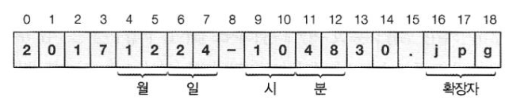

# 문자열 관리


## 첨자

* `문자열[정수]`  0부터 인덱싱
* `문자열[-정수]` 끝에서부터 인덱싱


<br/><br/><br/><br/><br/><br/>

```python
s = 'python'
print(s[2])    # t
print(s[-2])   # o
```

```python
s = 'python'
for c in s:
    print(c, end=',')  # p,y,t,h,o,n,
```

```python
s = 'python'
for i in range(len(s)):
    print(s[i], end=',')  # p,y,t,h,o,n,
```


## 슬라이싱

* `문자열[begin:end:step]`
  * `step:` 음수이면 뒤에서 진행


<br/><br/><br/><br/><br/><br/>

```python
s = '0123456789'
print(s[2:5])  # 234
print(s[3:])   # 3456789
print(s[:4])   # 0123
print(s[::2])  # 02468
```



<br/><br/><br/><br/><br/><br/>

```python
file = '20200101-104830.jpg'
print('촬영 날짜'+file[4:6]+'월'+file[6:8]+'일')     # 촬영 날짜01월01일
print('촬영 날짜'+file[9:11]+'월'+file[11:13]+'일')  # 촬영 시간10월48일
print('확장자'+file[-3:])                           # 확장자jpg
```


예제

```python
# '생년-월-일' 로 포맷팅 해서 출력
# 출신 지역 코드 출력

socialnum = '001212-3451231'

year = socialnum[:2]
month = socialnum[2:4]
date = socialnum[4:6]
region = socialnum[8:10]
gubun = socialnum[7]

if gubun == '1' or gubun == '2':
    year = '19'+year
else:
    year = '20'+year

print('생일:', year+'-'+month+'-'+date)   # 생일: 2000-12-12
print('지역코드:', region)                 # 지역코드: 45
```


## 검색

* `.find(str)`: `str`문자열을 찾아 인덱스 반환, 없으면 -1 반환
* `.rfind(str)`: 뒤에서 `str` 문자열을 찾아 인덱스 반환, 없으면 -1 반환
* `.index(str)`: `find()`와 동일, 없으면 예외 발생
* `.count(str)`: `str` 문자열이 몇번 등장하는지 리턴


<br/><br/><br/><br/><br/><br/>

```python
s = "python programming"

print(len(s))             # 18
print(s.find('o'))        # 4
print(s.rfind('o'))       # 9
print(s.index('r'))       # 8
print(s.count('n'))       # 2
```


## 조사

* `단어 in 문자열 -> bool`
* `단어 not in 문자열 -> bool`
* `.startswith(str) -> bool`
* `.endswith(str) -> bool`

```python
s = 'python programming'

print('a' in s)          # True
print('z' in s)          # False
print('pro' in s)        # True
print('x'not in s)       # True
```


```python
name = '홍길동'

if name.startswith('홍'):
    print('홍씨입니다.')            # 홍씨입니다.

if name.startswith('김'):
    print('김씨입니다.')

file = 'figure.jpg'
if file.endswith('.jpg'):
    print('JPG 그림 파일입니다.')    # JPG 그림 파일입니다.
```


## 기타 메서드

| 메서드         | 설명                                                         |
| -------------- | ------------------------------------------------------------ |
| `isalpha`      | 문자열이 알파벳(영어, 한글 등)으로만 이루어졌으면 True, 그렇지 않으면 False |
| `islower`      | 문자열이 모두 소문자로만 되어있으면 True, 그렇지 않으면 False |
| `isupper`      | 문자열이 모두 대문자로만 되어있으면 True, 그렇지 않으면 False |
| `isspace`      | 문자열이 단지 공백(whitespace)으로만 되어있을 경우 True, 그렇지 않으면 False |
| `isalnum`      | 문자열이 알파벳과 숫자로만 이루어졌으면 True, 그렇지 않으면 False |
| `isdecimal`    | 문자열이 10진수 문자이면 True, 그렇지 않으면 False           |
| `isdigit`      | 문자열이 숫자만 포함하고 있으면 True, 그렇지 않으면 False,` isnumeric()`과 동일 |
| `isnumeric`    | 문자열이 숫자만 포함하고 있으면 True, 그렇지 않으면 False    |
| `isidentifier` | 식별자인 경우에 True(식별자-'a-z'또는'A-Z', 숫자)            |
| `isprintable`  | 프린트가 가능한 경우 True                                    |

```python
height = input("키 : ")

if height.isnumeric():
	print("키 = ", height)
else:
	print("숫자만 입력하세요")
	
키 : abc
숫자만 입력하세요
```


## 변경

| 메서드          | 설명                                                  |
| --------------- | ----------------------------------------------------- |
| `.lower()`      | 모두 소문자로                                         |
| `.upper()`      | 모두 대문자로                                         |
| `.swapcase()`   | 대문자는 소문자로, 소문자는 대문자로 변환             |
| `.capitalize()` | 첫글자는 대문자 나머지는 모두 소문자로 변환           |
| `.title()`      | 모든 단어의 첫 글자를 대문자로 나머지는 소문자로 변환 |
| `.strip()`      | 좌우에 있는 공백을 제거                               |
| `.lstrip()`     | 왼쪽에 있는 공백을 제거                               |
| `.rtrip()`      | 오른쪽에 있는 공백을 제거                             |

```python
s = "Good morning. my love KIM."

print(s.lower())            #good morning. my love kim.
print(s.upper())            #GOOD MORNING. MY LOVE KIM.
print(s.swapcase())         #gOOD MORNING. MY LOVE kim.
print(s.capitalize())       #Good morning. my love kim.
print(s.title())            #Good Morning. My Love Kim.

s = "    angel    "

print(s + "님")             #     angel   님
print(s.strip() + "님")     # angel님
print(s.lstrip() + "님")    # angel    님
print(s.rstrip() + "님")    #     angel님
```


## 분할

* `.slpit(구분자)`
  * 구분자를 기준으로 단어를 분리하여 리스트로 리턴, 디폴트는 공백
* `.splitlines()`
  * 개행 문자를 기준으로 분리. 개행문자만 있는 경우 비어있는 문자열로 처리
* `결합문자열.join(문자열)`
  * 글자들을 결합문자열로 연결하여 하나의 문자열로 리턴


```python
s = '짜장 짬뽕 탕수육'
print(s.split())               # ['짜장', '짬뽕', '탕수육']

s2 = '서울->대전->대구->부산'
cities = s2.split('->')
print(cities)                  # ['서울', '대전', '대구', '부산']

for city in cities:
    print(city)                # 서울
                               # 대전
                               # 대구
                               # 부산
```


```python
travler = """
강나루 거너서
밀밭 길을

구름에 달 가듯이
가는 나그네
"""

poet = travler.splitlines()
for line in poet:
    print(line)
    
강나루 거너서
밀밭 길을
구름에 달 가듯이
가는 나그네
```


* 예제

```python
url = 'https://www.naver.com/blog/travel/seoul.html'

els = url.split('://')
print(els[0])  # https
print(els[1])  # www.naver.com/blog/travel/seoul.html

path = els[1].split('/')
fname = path[-1]
print(fname)   # seoul.html

ftype = fname.split('.')[-1]
print(ftype)   # html
```


## 대체

* `.replace(기존문자열, 대체문자열)`
  * 기존 문자열을 대체 문자열로 대체
* `.center(폭숫자)`
  * 좌우에 공백을 채워 폭숫자만큼 문자열 길이를 맞춤
* `.ljust(폭숫자)`
  * 왼쪽에 공백을 채워 폭숫자만큼 문자열 길이를 맞춤
* `.rjust(폭숫자)`
  * 오른쪽에 공백을 채워 폭숫자만큼 문자열 길이를 맞춤

```python
s = "독도는 일본땅. 대마도도 일본땅"
print(s)
print(s.replace("일본", "한국"))

독도는 일본땅. 대마도도 일본땅
독도는 한국땅. 대마도도 한국땅

message = "안녕하세요"
print(message.center(30))
print(message.ljust(30))
print(message.rjust(30))

          안녕하세요
안녕하세요
                    안녕하세요
```


## 포맷팅

| 포맷                  | 설명                              |
| --------------------- | --------------------------------- |
| `%d`                  | 정수                              |
| `%f`                  | 실수                              |
| `%s`                  | 문자열                            |
| `%c`                  | 문자 하나                         |
| `%h`                  | 16진수                            |
| `%o`                  | 8진수                             |
| `%%`                  | % 문자                            |
| `%[-]폭[.유효자리수]` | 폭에는 소수점에 포함, 반올림 발생 |

```python
price = 500
print('궁금하면 '+str(price)+'원!')  # 궁금하면 500원!
```

* Python 2 에서

```python
# python 2 기법이다!!!

mont = 8
day = 15
anni = '광복절'
print('%d월 %d일은 %s이다.' % (mont, day, anni))   # 8월 15일은 광복절이다.
```

* Python 3 에서 (선형포맷팅)
  * `"{[:포맷문자열]} ".format(값...)`
  * `"{인덱스[:포맷문자열]} ".format(값...)`
  * `"{변수명[:포맷문자열]} ".format(값...)`

```python
# python 3는 이렇게 한다.

name = '한결'
age = 16
height = 162.5
print('이름:{}, 나이: {}, 키: {}'.format(name, age, height))
print('이름:{:s}, 나이: {:d}, 키: {:f}'.format(name, age, height))
print('이름:{:4s}, 나이: {:3d}, 키: {:.2f}'.format(name, age, height))
print('이름:{0}, 나이: {1}, 키: {2}'.format(name, age, height))

이름:한결, 나이: 16, 키: 162.5
이름:한결, 나이: 16, 키: 162.500000
이름:한결 , 나이: 16, 키: 162.50
이름:한결, 나이: 16, 키: 162.5
```

* Python 3.7이상에서

```python
# python 3.7부터 지원하는 새로운 방법(f-string)
print(f'이름:{name}, 나이: {age}, 키: {height}')
print(f'이름:{name:4s}, 나이: {age:3d}, 키: {height:.2f}')

user1 = f'이름:{name}, 나이: {age}, 키: {height}'
print(user1)

이름:한결, 나이: 16, 키: 162.5
이름:한결  , 나이:  16, 키: 162.50
이름:한결, 나이: 16, 키: 162.5
```

* 예제

```python
# f-string 예제

socialnum = '001212-3451231'

# '생년-월-일' 로 포맷팅 해서 출력
# 출신 지역 코드 출력

year = socialnum[:2]
month = socialnum[2:4]
date = socialnum[4:6]
region = socialnum[8:10]
gubun = socialnum[7]

if gubun == '1' or gubun == '2':
    year = '19'+year
else:
    year = '20'+year

print('생일:', year+'-'+month+'-'+date)              # 생일: 2000-12-12
print('지역코드:', region)                            # 지역코드: 45

print(f'생일: {year}-{month}-{date}, age: {age}')    # 생일: 2000-12-12, age: 16
print(f'지역코드: {region}')                          # 지역코드: 45
```

