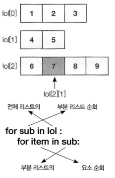

# List 와 Tuple


## 자료와 집합

### List

```python
nums = list(range(0, 10))

print(nums[:])            # [0, 1, 2, 3, 4, 5, 6, 7, 8, 9]
print(nums[2:5])          # [2, 3, 4]
print(nums[:4])           # [0, 1, 2, 3]
print(nums[6:])           # [6, 7, 8, 9]
print(nums[1:7:2])        # [1, 3, 5]
```

```python
score = [88, 95, 70, 100, 99]
total = 0

for s in score:
    total += s

print('총점: ', total)               # 총점:  452
print('평균: ', total/len(score))    # 평균:  90.4

print(list('Korea'))                 # ['K', 'o', 'r', 'e', 'a']

# 변수명이랑 함수명이랑 같으면 안된다. 오류는 아니지만
# 함수를 사용하지 못하게 되기때문에~~
```


* 리스트 요소 수정
  * `리스트[인덱스]`
  * `리스트[begin:end:step]`

```python
nums = list(range(0, 10))

nums[2] = 100
print(nums)

s = 'python'    # 숫자는 가능한데 왜 문자열은 안될까?
# s[2] = 'T'      # 문자열은 불변 객체이기 때문에 안된다!
print(s)        # 읽기만 가능하고 쓰기는 불가능
```

* 삽입

```python
# 기존값을 삭제하고 , 새로운 값으로 대체 (삽입)

nums = list(range(0, 10))
nums[2:5] = [20, 30, 40]
print(nums)
# [0, 1, 20, 30, 40, 5, 6, 7, 8, 9]

nums[6:8] = [60, 70, 80, 90]
print(nums)
# [0, 1, 20, 30, 40, 5, 60, 70, 80, 90, 8, 9]
```

* 리스트와 연산자

```python
list1 = [1, 2, 3, 4, 5]
list2 = [10, 11]
print(list1+list2)   # [1, 2, 3, 4, 5, 10, 11]
print(list2*3)       # [10, 11, 10, 11, 10, 11]
```

* 이중 리스트



```python
#          0        1          2
#       0  1  2    0  1    0  1  2  3
lol = [[1, 2, 3], [4, 5], [6, 7, 8, 9]]
print(lol[0])           # [1, 2, 3]
print(lol[2][1])        # 7  # 리스트안의 리스트의 요소

for sub in lol:
    for item in sub:
        print(item, end=' ')
    print()

# 1 2 3
# 4 5
# 6 7 8 9
```

```python
# 이중 리스트 예제

score = [
    [88, 76, 92, 98], 
    [65, 70, 58, 82], 
    [82, 80, 78, 88]]

total = 0
totalsub = 0

for student in score:
    subject_total = 0                  # subject_total -> snake 표기법
    for subject in student:            # subjectTotalSum -> CamelCase(낙타 표기법)
        subject_total += subject       # subject-total -> 케밥 표기법(HTML)

    subjects = len(student)
    print(f'총점 {subject_total}, 평균 {subject_total/subjects:.2f}')
    total += subject_total
    totalsub += subjects

# 총점 354, 평균 88.50
# 총점 275, 평균 68.75
# 총점 328, 평균 82.00

print(f'전체평균 {total/totalsub:.2f}')

# 전체평균 79.75
```

* 컴프리 핸션
  * `[수식 for 변수 in 리스트 if 조건]`
    * 내부의 리스트를 순회하며 각 요소에 대한 수식을 적용하여 최종 요소를 생성한다.
    * `if`조건을 추가하면 조건을 만족하는 요소만 추가 할 수 있다.

```python
print([n for n in range(1, 11)])
# [1, 2, 3, 4, 5, 6, 7, 8, 9, 10]

nums = [n*2 for n in range(1, 11)]
for i in nums:
    print(i, end=', ')
    # 2, 4, 6, 8, 10, 12, 14, 16, 18, 20,

nums = [n*2 for n in range(1, 11) if n % 2 == 0]
for i in nums:
    print(i, end=', ')
    # 4, 8, 12, 16, 20,

nums = []
for n in range(1, 11):
    nums.append(n*2)

print(nums)
# [2, 4, 6, 8, 10, 12, 14, 16, 18, 20]

print([n for n in range(1, 11) if n % 3 == 0])
# [3, 6, 9]


# 랜덤 정수 100개를 리스트에 담아라. 사용법 잘익히자~~

import random            # random.randrange(1,101)
random_numbers = [random.randrange(1, 101) for _ in range(50)] # for n in 인데 n을 안 쓸 경우 _로 대체

print(random_numbers)

random_numbers=[]
for _ in range(50):
    random_numbers.append(random.randrange(1,101))

print(random_numbers)
# [12,34,23,65....] 50개
```

* 메소드 이용한 삽입,연결
  * `.append(값)`
    * 리스트의 끝에 값을 추가
  * `.insert(위치, 값)`
    * 지정한 위치에 값을 삽입
  * `.extend(값)`
    * 한개의 리스트 끝에 다른 리스트를 연결 확장

```python
nums = [1, 2, 3, 4]
nums.append(5)
print(nums)  # [1, 2, 3, 4, 5]

nums.insert(2, 99)
print(nums)  # [1, 2, 99, 3, 4, 5]

nums = [1, 2, 3, 4]
nums[2:2] = [90, 91, 92]  # 새로운 값들을 삽입 슬라이싱
print(nums)  # [1, 2, 90, 91, 92, 3, 4]


nums = [1, 2, 3, 4]
nums[2] = [90, 91, 92]  # 지정한 위치의 엘리먼트에 리스트 대체 인덱싱
print(nums)  # [1, 2, [90, 91, 92], 4]


list1 = [1, 2, 3, 4, 5]
list2 = [10, 11]
list3 = list1 + list2  # 새로운 리스트를 리턴
print(list3)   # [1, 2, 3, 4, 5, 10, 11]

list1.extend(list2)  # 기존 리스트를 확장
print(list1)   # [1, 2, 3, 4, 5, 10, 11]
```

* 메소드를 이용한 삭제

  * `.remove(값)`
    * 리스트에서 값을 찾아 첫번째 해당 요소를 제거
  * `del(리스트[인덱스])`
    * 지정한 인덱스의 요소를 제거
  * `[시작:끝] = []`
    * 지정한 범위의 요소를 제거

  ```python
  score = [88, 95, 70, 100, 99, 88, 78, 50]
  score.remove(100)
  print(score)   # [88, 95, 70, 99, 88, 78, 50]
  
  del(score[2])
  print(score)   # [88, 95, 99, 88, 78, 50]
  
  score[1:4] = []
  print(score)   # [88, 78, 50]
  
  # 삭제를 하는데 그 값이 뭔지 궁금할때 .pop()사용한다.
  ```

  * `.pop()`
    * 리스트의 끝 요소를 삭제하고 삭제한 요소를 리턴
  * `.pop(인덱스)`
    * 지정한 인덱스의끝 요소를 삭제하고 삭제한 요소를 리턴

  ```python
  # .pop()
  # 인덱스가 없으면 리스트의 끝 요소를 삭제하고 삭제한 요소를 리턴
  
  score = [88, 95, 70, 100, 99]
  print(score.pop())     # 99
  print(score.pop())     # 100
  print(score.pop(1))    # 95
  print(score)           # [88, 70]
  ```

* 스택,큐 방식 삭제

```python
stack = []

# 스택으로 데이터를 저장해야 됩니다.
stack.append(10)  # 10
stack.append(20)  # 10 20
stack.append(30)  # 10 20 30

# 데이터를 스택에서 꺼내는 것.
v1 = stack.pop()  # 30  /  10 20
v2 = stack.pop()  # 20  /  10

stack.append(40)  # 10 40

# 큐방식 관리(통신에 만이 쓰임 buffer 뒤에 넣고 맨앞에서 빼고)
score = [88, 95, 70, 100, 99]
score.append(50)
print('큐', score)         # 큐 [88, 95, 70, 100, 99, 50]
print('큐', score.pop(0))  # 큐 88
print('큐', score)         # 큐 [95, 70, 100, 99, 50]


# 스택방식 관리 (뒤에 넣고 뒤에서 빼고)
score = [88, 95, 70, 100, 99]
score.append(50)
print('스택', score)        # 스택 [88, 95, 70, 100, 99, 50]
print('스택', score.pop())  # 스택 50
print('스택', score)        # 스택 [88, 95, 70, 100, 99]
```

* 검색

  | 메소드                           | 설명                                                   |
  | -------------------------------- | ------------------------------------------------------ |
  | `.index(값)`                     | 지정한 값을 찾아 해당 요소를 리턴, 없으면 예외 발생    |
  | `.count(값)`                     | 지정한 값이 리스트에 몇 번 나오는지 계산하여 리턴      |
  | **함수**                         | **설명**                                               |
  | `len(시퀀스)`                    | 시퀀스의 길이(요소수) 리턴                             |
  | max(시퀀스)                      | 시퀀스 요소중 최대값 리턴                              |
  | min(시퀀스)                      | 시퀀스 요소중 최소값 리턴                              |
  | **코드**                         | **설명**                                               |
  | `값 in 시퀀스, 값 not in 시퀀스` | 값이 시퀀스에 포함되어 있는지 여부를 True/False로 리턴 |

  ```python
  # 1~100 번위에서 10개의 랜덤한 숫자로된 리스트를 구성하세요.
  import random
  
  # 난수표에서 특정한 난수 조합을 사용한다. 몇번을 돌려도 같은 난수집합으로
  # 개발과정중에는 고정하고 개발이 끝나면 지우면 된다.
  # random.seed(0)
  
  numbers = [random.randrange(1, 101) for _ in range(10)]
  print(numbers)
  
  # 두개의 요소를 서로 바꿔주는 함수
  
  def swap(ix1, ix2):
      temp = numbers[ix1]
      numbers[ix1] = numbers[ix2]
      numbers[ix2] = temp
  
  swap(2, 4)
  print(numbers)
  
  # 최대값을 찾아서, 0번과 바꾸세요.
  
  max_value = max(numbers)
  max_ix = numbers.index(max_value)
  
  swap(0, max_ix)
  print(numbers)
  
  # 정렬하기 함수와 메소드를 이용해서 한거 밑에 더 쉬운 방법이 있을거얌~~
  
  # 오름차순
  for i in range(0, len(numbers)):
      max_value = max(numbers[i:])
      max_ix = numbers.index(max_value)
      swap(i, max_ix)
  
  print(numbers)
  
  # 내림차순
  for i in range(0, len(numbers)):
      min_value = min(numbers[i:])
      min_ix = numbers.index(min_value)
      swap(i, min_ix)
  
  print(numbers)
  리스트를 정렬(디폴트는 오름차순)
  reverse=True 오름차순 reverse=False 내림차순 선택
  ```

* 정렬

| 메소드                                       | 설명                                                         |
| -------------------------------------------- | ------------------------------------------------------------ |
| `.sort([reverse=True][key=키에 적용할 함수]` | 리스트를 정렬(디폴트는 오름차순)<br>reverse=True 오름차순 reverse=False 내림차순 선택 |
| `.reverse()`                                 | 리스트의 순서를 역으로 바꿈                                  |
| **함수**                                     | **설명**                                                     |
| `sorted(시퀸스)`                             | 지정한 시퀸스를 정렬하여 새로운 리스트로 리턴                |

```python
score = [88, 95, 70, 100, 99]

score.sort()
print(score)    # [70, 88, 95, 99, 100]

score.reverse()
print(score)    # [100, 99, 95, 88, 70]

sorted_score = sorted(score)

score = [88, 95, 70, 100, 99]

print(score)         # [88, 95, 70, 100, 99]
print(sorted_score)  # [70, 88, 95, 99, 100]

score = [88, 95, 70, 100, 99]

sorted_score2 = sorted(score, reverse=True)

print(score)          # [88, 95, 70, 100, 99]
print(sorted_score2)  # [100, 99, 95, 88, 70]


country = ['Korea', 'japan', 'CHINA', 'america']

country.sort()
print(country)  # ['CHINA', 'Korea', 'america', 'japan']

country.sort(key=str.lower)
print(country)  # ['america', 'CHINA', 'japan', 'Korea']
```

### Tuple

* (값, ... )
* 값, [...]
* 추가/수정/삭제 불가
* 읽기만 가능 --> 리스트보다 속도가 빠름

```python
import time
score = (88, 95, 70, 100, 99)  # score = 88, 95, 70, 100, 99 똑같다 튜플표시 방법
total = 0

for s in score:
    total += s

print('총점 : ', total)              # 총점 :  452
print('평균 : ', total/len(score))   # 평균 :  90.4

# 튜플로 슬라이싱이나 새로운 값을 추가하는 것은 가능하지만
# 원본을 변화하는 것은 불가

tu = 1, 2, 3, 4, 5
print(tu[3])        # 4
print(tu[1:4])      # (2, 3, 4)
print(tu + (6, 7))  # (1, 2, 3, 4, 5, 6, 7)
print(tu * 2)       # (1, 2, 3, 4, 5, 1, 2, 3, 4, 5)

# tu[1] = 100 # 불가능
# del tu[1] # 불가능tu[1] = 100 # 불가능
# del tu[1] # 불가능
```

* Tuple로 가능한 일

```python
names = "이순신", "김유신", "강감찬"
lee, kim, kang = names  # unpack

print(lee)   # 이순신
print(kim)   # 김유신
print(kang)  # 강감찬


a, b = 12, 34
print(a, b)  # 12 34

a, b = b, a   # swap하는거다 튜플이라서 가능
print(a, b)  # 34 12
```

```python
def gettime():
    now = time.localtime()
    return now.tm_hour, now.tm_min


result = gettime()
print('지금은 %d시 %d분 입니다.' % (result[0], result[1]))
# 지금은 20시 11분 입니다.

hour, minute = gettime()
print('지금은 %d시 %d분 입니다.' % (hour, minute))
# 지금은 20시 11분 입니다.
```

```python
d, m = divmod(7, 3)
print("몫", d)     # 몫 2
print("나머지", m)  # 나머지 1


score = [88, 95, 70, 100, 99]
tu = tuple(score)
print(tu)     # (88, 95, 70, 100, 99)

li = list(tu)
li[0] = 100
print(li)     # [100, 95, 70, 100, 99]
```

